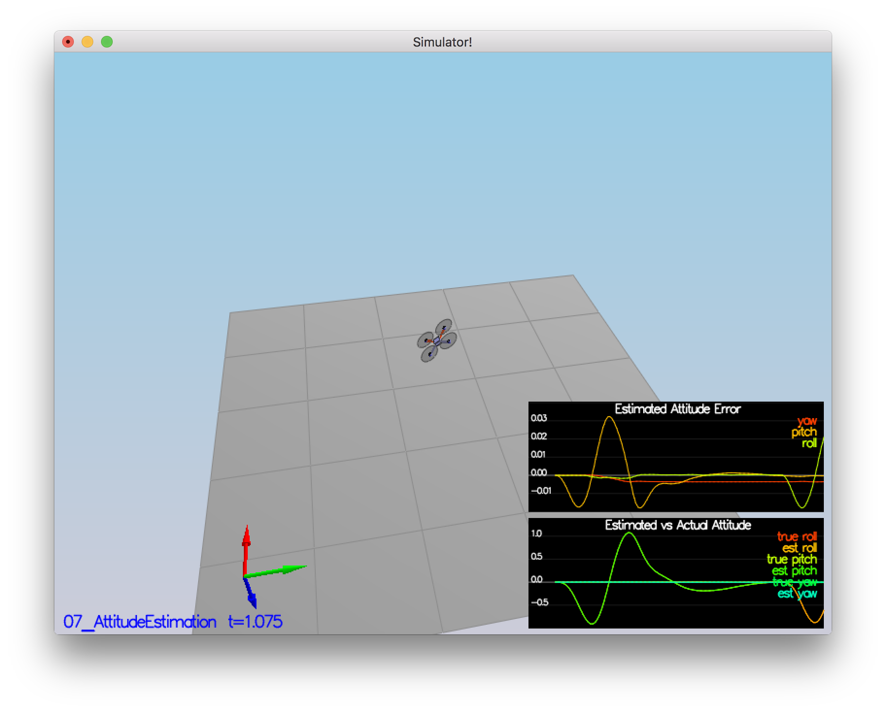
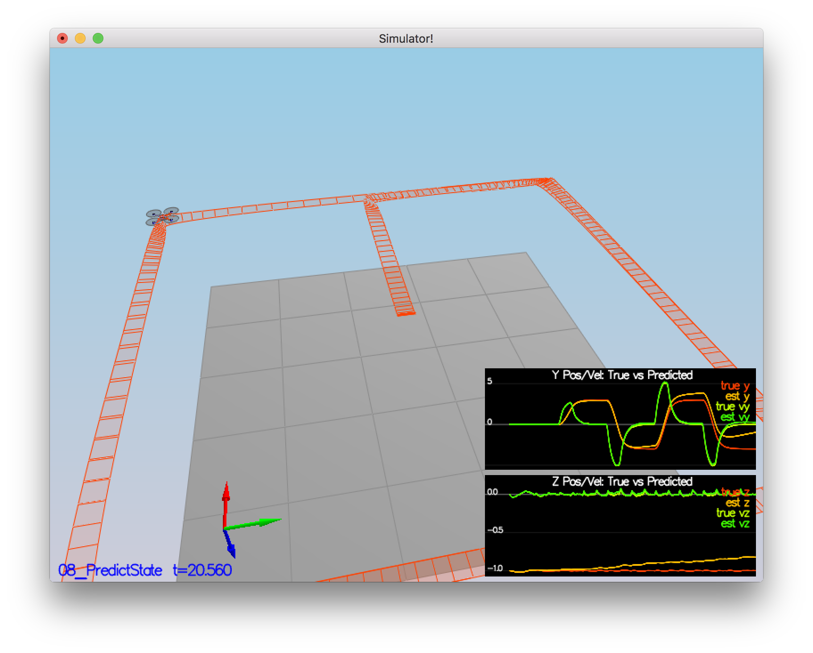
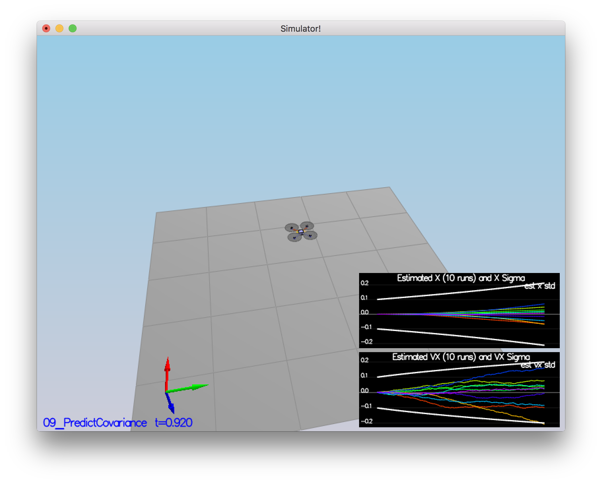
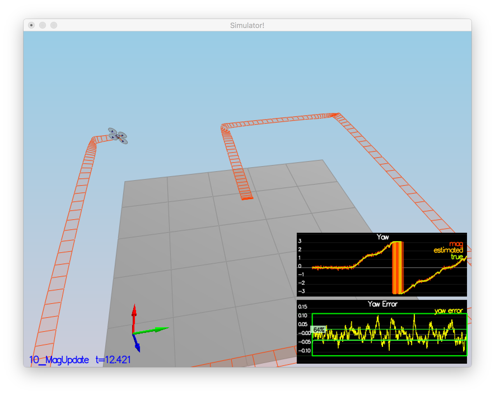
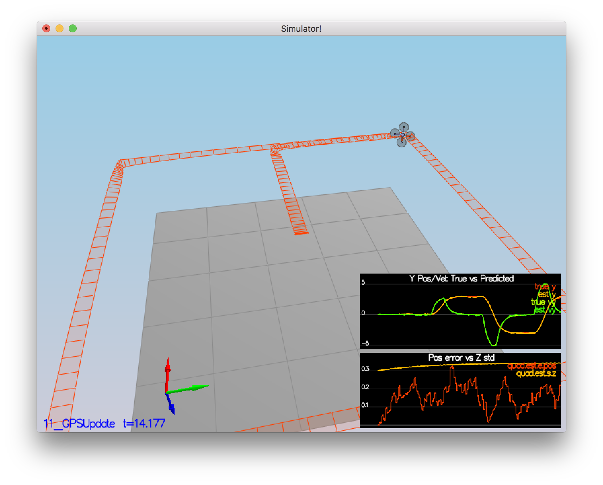

# 3-D Estimation of A Quadcopter #

## The Tasks ##

### Calculate Standard Deviation of Quads sensor ###

To calculate the standard deviation of quads sensors, I wrote a python script using Jupyter notebook to load all the data for a sensor (Accelerometer or GPS).

The standard deviation of GPS sensor data was found out to be 0.705265302931 and similarly for Accelerometer the standard deviation was 0.509928551281.


### Step 2: Attitude Estimation ###

In this step I implemented a complimentary filter to integrate rate gyros information to better estimate the attitude of the quad.

As we want to implement a non-linear complimentary filter, I converted the estimated roll, pitch and yaw information represented in global frame to a quaternion in body frame. The value of quaternion is integrated over the dtIMU time by providing the measurements from gyro sensors, which are given in body frame as well.

The value of quarternion obtained after integration is then converted back to euler angles in global frame to accurately represent the attitude of the vehicle.

The code for this task is located at line 74 in file `QuadEstimatorEKF.cpp`.

Below is the result of the simulation after implementing this step.

<p align="center">

</p>

### Step 3: Prediction Step ###
This step involved three mini-steps.

The first part was to predict a new state based on current state by dt time and using current accelerations and body rates as input. To implement this step I integrated the position values by dt time. To update the velocity values, I used the acceleration in body frame converted to quarternion and then to global frame values and integrated the acceleration with dt time. The code for this task is located at line 143 in file `QuadEstimatorEKF.cpp`.

The second step was to calculate the partial derivate of body-to-global rotation matrix in the function GetRbgPrime(). I used the reference document `Estimation for Quadrotors` to implement the matrix. The code for this task is located at line 194 in file `QuadEstimatorEKF.cpp`.

The third step was to implement the final Predict() function. It uses the predict state from step-1 above and RgbPrime matrix from ste-2 above to predict the new state and covariance matrix based on the Extended Kalman Filter equations. The code for this task is located at line 232 in file `QuadEstimatorEKF.cpp`.

Below is the result of the simulation after implementing this step.

<p align="center">

</p>


<p align="center">

</p>


### Step 4: Magnetometer Update ###
In this step, the magnetometer measurements were taken into consideration to update the yaw predicted value. The magnetometer reports yaw in global frame and is linear. Thus, the partial derivate of function h(t) is a mtrix of zeros and one.

```
h_prime(x_t) = [0 0 0 0 0 0 1]
```

The code for this task is located at line 329 in file `QuadEstimatorEKF.cpp`.

Below is the result of the simulation after implementing this step.

<p align="center">

</p>

### Step 5: Closed Loop + GPS Update ###
Similar to magnetometer measurement update step, this step was used to update the positions (x, y, z) and velocities (x_dot, y_dot, z_dot) from the predicted step. I used the matrix equation h_prime as described in document `Estimation for Quadrotors` to update the state variables.


The code for this task is located at line 296 in file `QuadEstimatorEKF.cpp`.

Below is the result of the simulation after implementing this step.

<p align="center">

</p>


### Step 6: Adding Your Controller ###
In this step, I copied over the implementation of Quad control from previous project "3-D Quadrotor control" into the file `QuadControl.cpp` and used the same QuadControl parameters from the previous project.

Initially, the Position control gain and velocity control gain values were not ideal for the quadrotor in estimation project and led to crash of quad after a few seconds of simulation. I then reduced the position and velocity control gains by 30-35% as suggested in docs and quad was then able to maintain the position without crashing unexpectedly.
